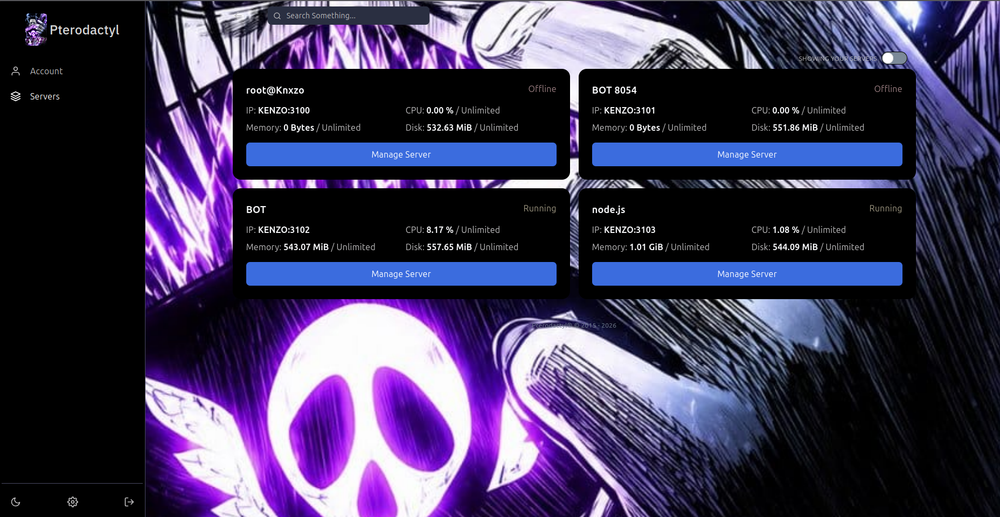

# Pterodactyl Multi-Theme Installer — Kenxzo Official

Installer menu-driven untuk tema **Stellar** dan **Enigma** di [Pterodactyl Panel](https://pterodactyl.io), sudah diperbaiki supaya kompatibel dengan panel versi modern (Node.js 22+, Webpack 5). Bisa ganti-ganti tema atau uninstall kapan saja tanpa merusak instalasi panel aslinya.

## Kredit

- **Desain tema Stellar:** $ Kenxzo
- **Desain tema Enigma:** berasal dari tema "Enigma Premium" — ditemukan indikasi ini juga awalnya tema berbayar yang bocor/di-reupload.
- **Fix kompatibilitas (Node 22 / Webpack 5 / Pterodactyl 1.15.x), installer menu, branding & dokumentasi:** Kenxzo Official.

> Repo ini bukan klaim kepemilikan atas desain aslinya — ini hasil porting/fix agar tema-tema lama tetap bisa dipakai di panel versi baru, dikemas ulang jadi satu installer yang rapi.

## Screenshot



## Requirement

| Software | Versi minimum |
|---|---|
| Pterodactyl Panel | Terverifikasi jalan di v1.15.x |
| Node.js | **>= 22** (installer otomatis upgrade kalau kurang) |
| PHP | Sesuai requirement panel kamu (8.1+) |
| Yarn | 1.22.x (classic) |

## Instalasi

> **Sebelum jalankan:** pastikan Pterodactyl Panel sudah terinstall di `/var/www/pterodactyl`
> (kalau path-nya beda, edit variabel `PANEL_DIR` di `install.sh` dulu sebelum run).

```bash
git clone https://github.com/kenzow-OfficialHost/Instalation-ThemaPtrodactyl2026.git
cd pterodactyl-theme-installer
sudo bash install.sh
```

Script akan menampilkan menu:

```
 1. Install tema Stellar
 2. Install tema Enigma
 3. Uninstall tema (kembali ke panel bersih)
 x. Batal
```

Tinggal ketik nomor, Enter, dan ikuti instruksi (Enigma akan minta 3 link: WhatsApp, Group, Channel).

## Cara Kerja (Arsitektur)

Supaya ganti tema atau uninstall **tidak pernah merusak** panel kamu:

1. **Sekali saja**, saat pertama kali installer dijalankan, seluruh isi `/var/www/pterodactyl` di-backup utuh ke `/var/www/pterodactyl-pristine-backup`. Ini adalah kondisi panel "bersih tanpa tema apapun".
2. **Setiap kali install/ganti tema**, panel direstore dulu ke kondisi pristine tadi, baru file tema yang dipilih di-overlay di atasnya. Ini mencegah tema lama menumpuk/bentrok dengan tema baru.
3. **Uninstall** = restore ke pristine backup, lalu rebuild — panel kembali ke kondisi sebelum tema apapun pernah dipasang.

File `/root/.kenxzo-theme-state` menyimpan nama tema yang lagi aktif (buat ditampilin di menu, bukan buat logic penting).

## Troubleshooting

Error di bawah ini adalah error nyata yang muncul saat proses debug — sudah ditangani otomatis oleh `install.sh`, dicatat di sini kalau perlu fix manual di kondisi lain.

### 1. `The engine "node" is incompatible with this module. Expected version ">=22"`

**Fix manual:**
```bash
curl -fsSL https://deb.nodesource.com/setup_22.x | bash -
apt install -y nodejs
```

### 2. `Module not found: Error: Can't resolve 'path'` saat `yarn build:production`

**Penyebab:** Webpack 5 tidak lagi otomatis polyfill core module Node.js.

**Fix manual:**
```bash
cd /var/www/pterodactyl
yarn add path-browserify
```
Tambahkan di `webpack.config.js`, bagian `resolve: { ... }`:
```js
fallback: {
    path: require.resolve('path-browserify'),
},
```

### 3. Logo di sidebar (Stellar) muncul ikon "gambar rusak"

**Penyebab:** URL logo di **Admin → Theme** diisi tanpa `https://` di depannya.

**Fix:** buka `https://domain-panel-kamu/admin/theme`, pastikan field logo diawali `https://` penuh, contoh:
```
https://img3.pixhost.to/images/5191/762221600_image.jpg
```

### 4. `Class "Carbon" not found` saat `php artisan migrate` (Stellar)

**Status:** sudah diperbaiki permanen di paket ini (`use Carbon\Carbon;` sudah ditambahkan ke semua controller & migration terkait).

### 5. Mau ganti tema tapi takut rusak

Nggak perlu takut — tinggal jalankan `sudo bash install.sh` lagi, pilih tema lain. Installer otomatis restore ke pristine dulu sebelum overlay tema baru.

### 6. Mau balikin panel ke kondisi tanpa tema sama sekali

```bash
sudo bash install.sh
# pilih 3 (Uninstall)
```

## Struktur Folder

```
pterodactyl-theme-installer/
├── install.sh              # installer menu-driven (install/ganti/uninstall)
├── README.md
├── screenshots/
└── themes/
    ├── stellar/pterodactyl/   # file tema Stellar (sudah di-fix)
    └── enigma/pterodactyl/    # file tema Enigma (sudah di-fix)
```

## Catatan

- Backup pristine (`pterodactyl-pristine-backup`) memakan disk space sebesar instalasi panel kamu — pastikan disk cukup.
- Kalau update Pterodactyl Panel ke versi baru nanti, tema-tema ini mungkin perlu di-porting ulang kalau ada perubahan struktur komponen inti.
